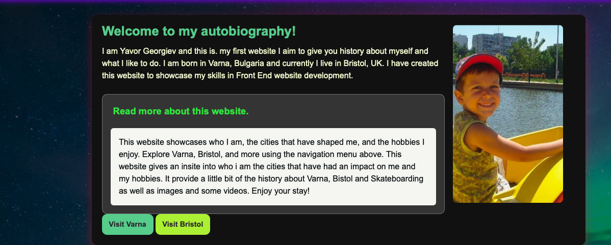
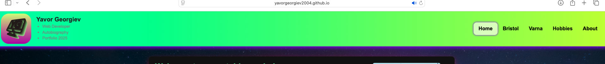
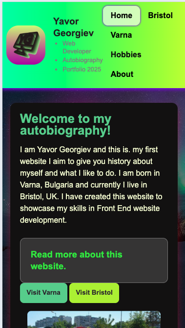
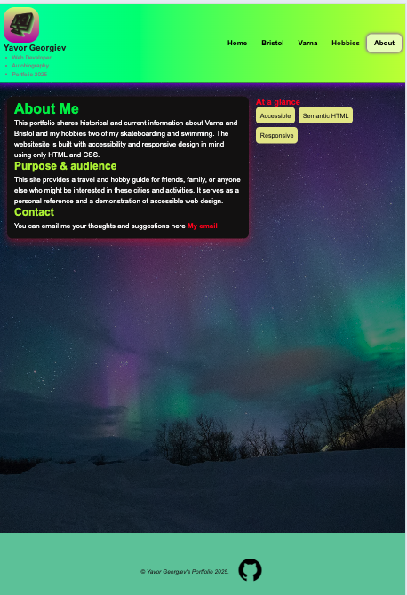
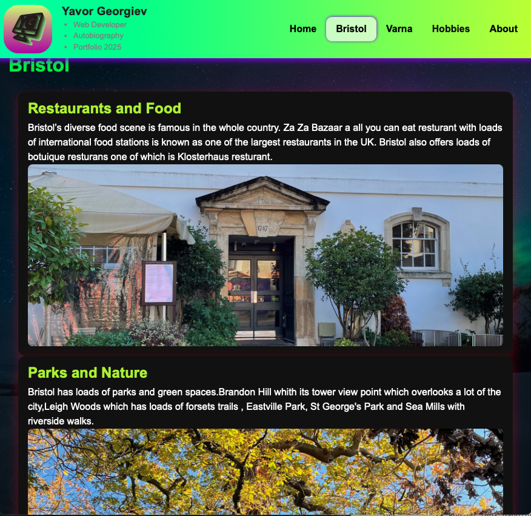
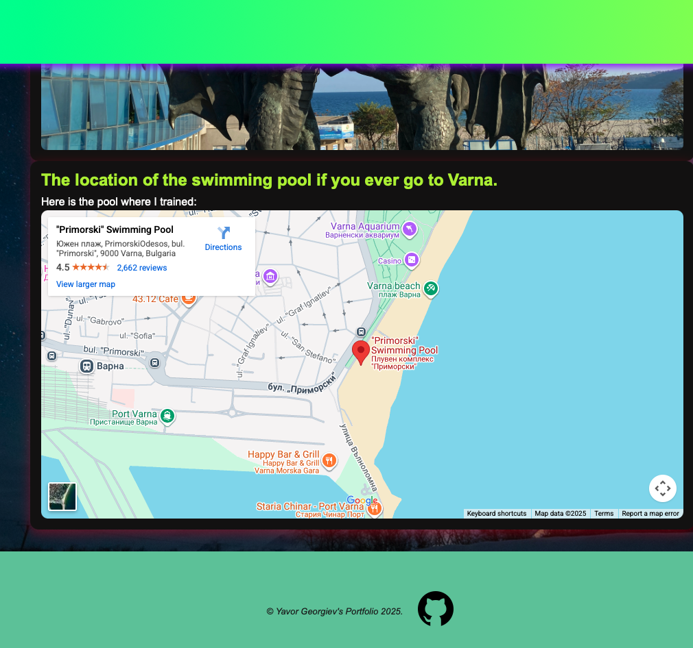
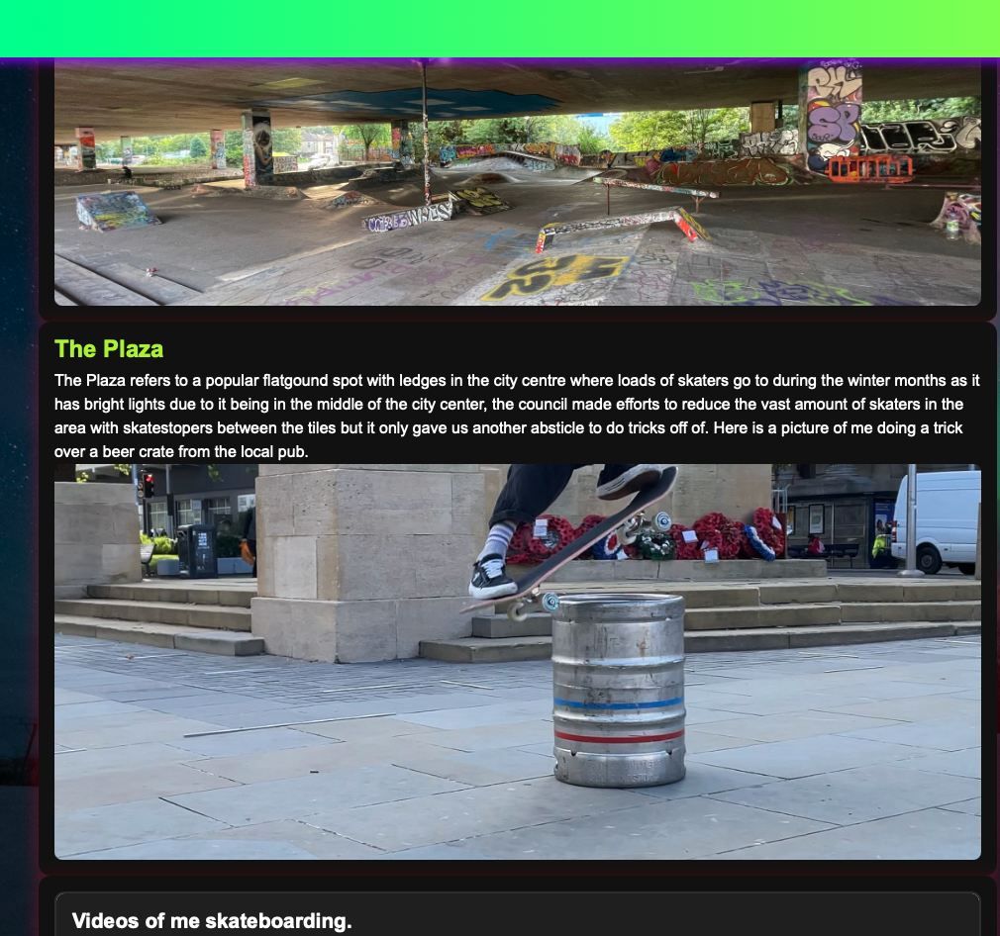
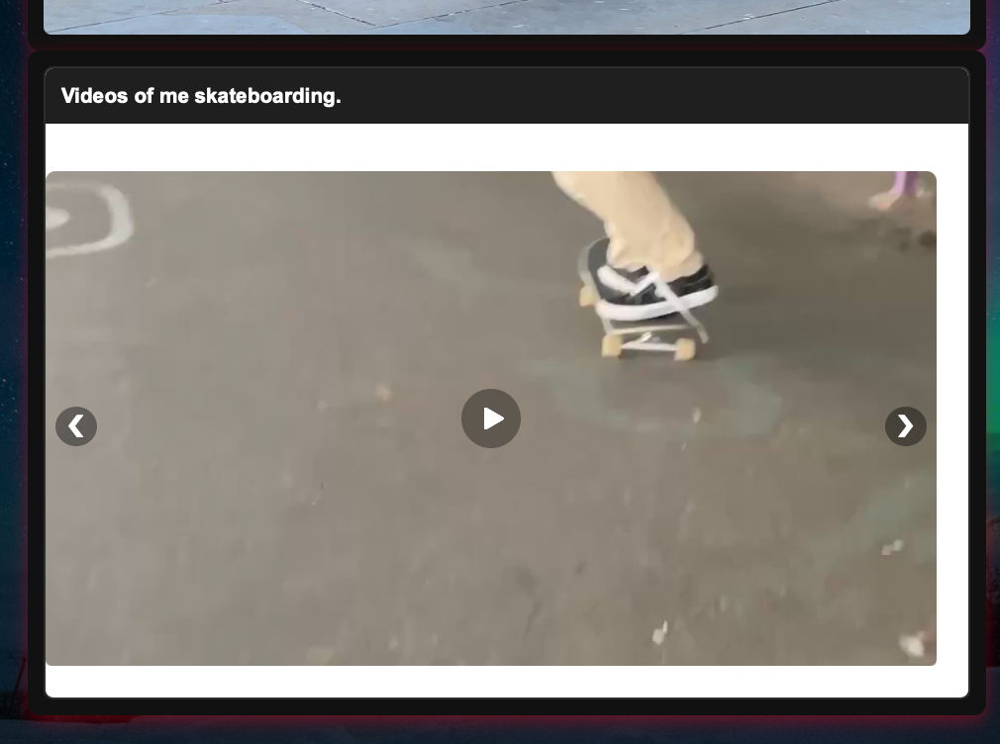

# Yavor Georgiev's Portfolio Website

A modern, responsive portfolio website showcasing my web development and personal interests and the cities ive lived in Bristol and Varna.

---

## 📋 Table of Contents

- [About the Project](#about-the-project)
- [Purpose and Value](#purpose-and-value)
- [User Stories](#user-stories)
- [Features](#features)
- [Technologies Used](#technologies-used)
- [Getting Started](#getting-started)
- [Deployment](#deployment)
- [Testing](#testing)
- [Code Attribution](#code-attribution)
- [Future Enhancements](#future-enhancements)
- [Contact](#contact)
- [Final pages/Video carosel/ Dopdowns Screenshots](#screenshots-final-pages-video-carosel-and-dropdowns)

---

## About the Project.

This portfolio website serves as my digital portfolio, showcasing my development skills and personal story. Built with semantic HTML5, CSS3 (including Flexbox and Grid), it shows my skills in front-end web development with accessibility and responsive design principles in mind.

### Purpose and Value.

**Purpose:**
- Provide a professional display of my skills for potential employers and educators.
- Showcase my web development skills through practical implementation.
- Share my journey between Bristol and Varna.
- Document personal hobbies.
- Demonstrate understanding of modern web development best practices.

**Value to Users:**

**For Recruiters/Employers:**
- Quick assessment of technical skills and coding style.
- Understanding of my background and interests.
- Easy contact method.
- Clear display of technical capabilities.

**For Personal Networking(Friends and like -minded individuals):**
-Storytelling of my life across two cities.
- Possible hared interests and hobbies.
- Accessible contact information.

---

## User Stories.

### User Story 1: Recruiter Evaluating Skills.

 As a recruiter looking for junior web developers.  
 I'd want to quickly assess the candidate's technical skills and see examples of their skills and work ethics.  
 So that I can determine if they're suitable for working in my company.

**Acceptance Criteria:**
- Clear display of technical skills on homepage.
- Responsive design demonstrating mobile-first approach.
- Clean, professional layout with good UX.

**Implementation:**
- Hero section with immediate introduction and skills.
- Fully responsive navigation and content.
- Professional color scheme and typography.
- Dropdown accordion video gallery.
- Carousel component for multiple videos showcasing advanced css skills.
- Card-based layout with CSS Grid.
- Clear headings and descriptions.
---

### User Story 2: Potential future collaborator exploring background and interests.


As a potential collaborator, 
I'd like to learn about the developer's background and interests. 
So that I can make a decision if we would work well together.

**Acceptance Criteria:**
- About page with personal story
- Hobbies and interests section
- Easy-to-find contact information

**Implementation:**
- Dedicated About page with biography.
- Hobbies page featuring skateboarding and swimming.
- Contact accesebility.

---

### User Story 3: Mobile User Browsing Portfolio

As a mobile user,  
I want to easily navigate the portfolio on my smartphone.  
So that I can view all content without frustration

**Acceptance Criteria:**
- Responsive navigation that works on small screens
- Touch-friendly buttons and links
- Images that scale appropriately
- Readable text without zooming

**Implementation:**
- Sticky navigation header with flexbox layout.
- Minimum touch target sizes (48x48px)
- Responsive images with `object-fit: cover`.
- Mobile-first CSS with appropriate breakpoints.

---

## Features

### Current Features

**✅ Implemented Features:**

1. **Responsive Navigation**
   - Sticky header that stays at top while scrolling.
   - Gradient background with custom CSS variables.
   - Dropdown menu for Hobbies section.
   - Active page highlighting.
   - Mobile-friendly with flexbox layout.

2. **Hero Section**
   - Eye catching introduction with an image.
   - Expandable popup within hero section.
   - Flexbox layout that stacks on mobile.

3. **Interactive Video Gallery**
   - Video carousel with navigation arrows.
   - Pure CSS.

4. **Cities Pages**
   - Dedicated pages for Bristol and Varna.
   - Embedded Google Maps iframe.
   - Responsive iframe sizing.
   - Information and history about each city.

5. **Hobbies Section**
   - Skateboarding and swimming sections.
   - Personal stories and achievements.

6. **Consistent Footer**
   - Copyright information.
   - Flexbox layout
   - Fixed to bottom using flexbox.
   - Custom color scheme matching site theme.

**Planned/Incomplete Features:**

- Contact form functionality.
- Back to top button.
- Dark mode toggle.

### Responsive Design.

- **Mobile-First Approach**: Base styles for mobile, enhanced for larger screens.
- **Breakpoint at 900px**: Changes from single to multi-column layouts.
- **Flexible Images**: `object-fit: cover` ensures proper scaling.
- **Viewport Units**: Uses a range of units for responsive sizing.

---

## Technologies Used

### Core Technologies

- **HTML5**: Semantic markup, ARIA labels
- **CSS3**: Flexbox, Grid, CSS Variables, Media Queries, Animations

### CSS Techniques

- **Flexbox**: Navigation, layout, footer centering and card alignment.
- **CSS Grid**: Responsive layouts.
- **CSS Variables**: Consistent theming with `--primary`, `--secondary`.
- **Transforms**: Hover effects with `translateY()`
- **Transitions**: Smooth animations.
- **Backdrop Filter**: Glassmorphism effects.
- **Box-Sizing**: `border-box` model for predictable and consitent layouts

### Design Patterns

- **BEM(Block, Element and modifier)inspired naming**: `.hero-card`, `.dropdown-content`, `.nav-header`.
- **Mobile-First CSS**: Base styles for mobile, `@media (min-width)` for desktop.
- **Sticky Positioning**: Header and footer.
- **Custom Radio Button Controls**: Pure CSS carousel.

---

## Getting Started

### Requrements

- A modern web browser Chrome, Firefox, Safari or Edge.
- Text editor, VS Code recommened
- Git

### Local Installation

1. **Clone the repository**
   ```bash
   git clone https://github.com/yourusername/portfolio.git
   ```

2. **Navigate to project directory**
   ```bash
   cd portfolio
   ```

3. **Open in browser**
   - Double-click `index.html`, or
   - Right-click `index.html` → Open With → Browser, or
   - Use a local server:
   
   ```bash
   # Using Python 3
   python -m http.server 8000
   
   # Using Node.js (install live-server first: npm install -g live-server)
   live-server
   ```

4. **View in browser**
   - Navigate to `http://localhost:8000`

---

## Deployment

### How I Deployed This Website to GitHub Pages

**Initial Setup:**

I started with my portfolio files on my local computer, organized in a folder structure with `index.html`, `style.css`, and an `assets/` folder containing my images. Before deploying, I made sure all my file paths were relative (like `href="style.css"` instead of `href="/style.css"`) to ensure they would work on GitHub Pages.

**Step 1: Created a GitHub Account and Repository**

1. I signed up for a free account at [GitHub.com](https://github.com)
2. Once logged in, I clicked the "+" icon in the top right corner.
3. Selected "New repository" from the dropdown.
4. Filled in the repository details:
   - **Repository name**: `autobiagraphy` (I chose this name, but you can use any name)
   - **Public**: ✅ I checked this box (required for free GitHub Pages)
   - **Initialize with README**
5. Clicked the green **"Create repository"** button

**Step 2: Uploaded My Files to GitHub**

I used GitHub's web interface to upload my files:

1. On my new repository page, I clicked **"uploading an existing file"** link
2. Created .html and .css files and folder directories.
3. Scrolled down to the commit section
4. Added commit messages
5. Clicked **"Commit changes"**
6. Waited for the upload to complete.

**Step 3: Enabled GitHub Pages**

This is the crucial step that makes your site live:

1. In my repository, I clicked on **"Settings"** 
2. In the left sidebar, I scrolled down to **"Pages"** 
3. Under **"Build and deployment"**, I found the **"Source"** dropdown
4. Selected:
   - **Branch**: `main`
   - **Folder**: `/ (root)` 
5. Clicked **"Save"**
6. GitHub showed me a blue banner saying "GitHub Pages source saved"

**Step 4: Waited for Deployment**

- I refreshed the Settings → Pages page after 2-3 minutes
- A green banner appeared at the top with my live URL
- I clicked the **"Visit site"** button to see my live website!

**Step 5: Verified Everything Worked**

I went through my entire website checking:
- ✅ All pages loaded correctly
- ✅ Navigation links worked
- ✅ Images displayed properly
- ✅ CSS styling was applied
- ✅ Responsive design worked on mobile (tested by resizing browser)

**Initial Issues I Encountered:**

1. **Footer overlaying content**: My biggest challenge was the footer appearing on top of my main content instead of staying at the bottom. I tried using `position: absolute` which caused it to overlap. I solved this by:
   - Removing absolute positioning from the footer
   - Using flexbox on the body with `min-height: 100vh`
   - Adding `flex: 1` to main content area
   - This pushed the footer to the bottom naturally without overlapping

2. **Images not loading**: Some of my image paths had uppercase letters in code but lowercase in filenames. GitHub is case-sensitive, so I fixed this by matching the exact case.
   
3. **CSS not applying on Safari**: I had used `width: 100vw` on my footer which caused horizontal scrollbar issues in Safari. Changed it to `width: 100%` to fix this.

4. **Navigation not spacing correctly**: The logo and nav links weren't separating properly. Fixed by adding `width: 100%` to `.internal-nav-items` so `justify-content: space-between` would work.

---

## Testing
I will text the functionality by pressing all the navigation buttons on all pages for the mobile and desktop verision of the site navigation to verify that the links work adequately as well as test the footer link to github which opens in a new window by pressing the icon, i will also test all the 'visit Bristol' and 'visit Varna' buttons and the 'Go to skateboarding' and 'go to Swimming' buttons. Additionaly i will test the dropdown in the hero section of the home page where it says 'Click to read more about this website.' to ensure the summary text is presentet when the section is clicked and it stays there until the user decides to close it. I will also test the dropdown in the skateboarding page which hold a video carosel and has a hover effects, i will ensure the functionality of the hover effects and the video carosel by testing if it responds to being open, if the videos fit well on different screen sizes and are responsive, if the videos change when the arrows are clicked and if the rest of the  conrols work. I will also test if the navigation shows which page it is on by highlighting the link in the navigation which corresponds to it. I will test the hover dropdown on the Hobbies section of the navigation works on all pages . I will ensure each page passes through the W3C validator and the CSS of the website passes through the Jigsaw validator without any errors. I will make sure the website is usable and accesible to peaople who might have vision imparement or other special needs. I will ensure there are no seisure conserns and all pop ups are not aggresive as well as no sound is played without it being the users choise.I will test the usability by testing major browser platforms such as Chrome and Safari  and if they support the website design and functionality and its responsivnes by consucting all of these tests described above on each platform .

#### Manual Testing

| Feature | Test Case | Expected Result | Pass/Fail |
|---------|-----------|----------------|-----------|
| Navigation | Click all nav links on all pages  | Navigate to correct pages | ✅ Pass |
| home page navigation buttons | testing if buttons will lead to the desired page correctly | excpection buttons to Navigate to correct pages | ✅ Pass |
| Responsive Nav | Resize browser to mobile and check if all links still work on all pages | expection the Nav to remain functional and lead to correct pages  | ✅ Pass |
| Dropdown Menu | see if Hover function over "Hobbies" presents the options of skateboarding and swimming pages on desktop |expection the dropdown to appear with links | ✅ Pass |
| Hero Popup | Click "More About Me" on the home page hero to present summary text | expecting the content to expand smoothly and present the information corectly without any spill outs | ✅ Pass |
| Carousel navigation | Click carousel arrows | Slides change correctly | ✅ Pass |
| Carousel dropdown  | video carousel test by clicking  | expecyting  dropdown to open and present the videos positioned and scaled correctly without any distortion or overlap  | ✅ Pass |
| Carousel video and audio controls | Testing the controls of the videos to see if the succsefuly play/pause and mute/unmute the videos  | Expection the controls to allow the videos to be paused/played and muted/unmuted correctly | ✅ Pass |
| Footer Links | Click Github logo link to see if it opens github in a new external tab| Expection to Open github in a new tab | ✅ Pass |
| Email link in about page  | Click mail link to see if it will open the default email method on the browser to send an email to me  | expection to open the default emailing provider and be able to send an email  | ✅ Pass |
| Google Maps | Test if iframe shows and loads correct swimming pool location | Expect the map to render correctly | ✅ Pass |

#### Browser Compatibility
All manual test done on the following browsers 
| Browser | Status | Notes |
|---------|--------|-------|
| Chrome | ✅ Fully Supported | All features work |
| Safari | ✅ Fully Supported | All features work |


#### Responsive Testing

| Device | Screen Size | Status | Notes |
|--------|------------|--------|-------|
| iPhone SE | 375px | ✅ Pass | Navigation wraps correctly |
| iPad | 768px | ✅ Pass | Two-column layout works |
| Desktop | 1920px | ✅ Pass | Max-width constrains content |

#### Accessibility Testing
Used semantic html and alt text on images to ensure screen reder compatibility as well as other controling devices are able to navigate the website.
- ✅ Semantic HTML (`<nav>`, `<main>`, `<footer>`, `<article>`)
- ✅ Alt text on all images

### Known Issues

1. **Footer Overlay Issue (RESOLVED)**: Footer was initially overlapping content when using `position: absolute`
   - **Status**: ✅ Fixed
   - **Solution**: Implemented flexbox sticky footer pattern with `body { display: flex; flex-direction: column; min-height: 100vh; }` and `.main-content { flex: 1; }`
  2. **Sound issue (UNRESOLVED)**When a video is unmuted the sound will continue to play even when its changed to the next one unless it gets muted befora changing due to it being technicly still on hte screen just shifted tothe side this issue can not be fixed without advanced javascript and i dont have enough time to do the research and fix it on time. 

---

## Code Attribution

### External Code and Resources

#### CSS Reset and Best Practices

```css
/* Universal box-sizing with border-box */
/* Source: Paul Irish - https://www.paulirish.com/2012/box-sizing-border-box-ftw/ */
*, *::before, *::after {
    box-sizing: border-box;
}
```

**Attribution**: Paul Irish's influential article on using `border-box`. This technique is now considered a CSS best practice and is used by major frameworks like Bootstrap and Tailwind CSS.

---

#### Flexbox Layout Patterns

```css
/* Sticky footer using flexbox */
/* Source: CSS-Tricks - https://css-tricks.com/couple-takes-sticky-footer/ */
body {
    display: flex;
    flex-direction: column;
    min-height: 100vh;
}

.main-content {
    flex: 1;
}
```

**Attribution**: CSS-Tricks comprehensive guide on flexbox layouts. The sticky footer technique ensures the footer stays at the bottom even on pages with little content.

---

#### CSS Variables (Custom Properties)

```css
/* CSS Custom Properties pattern */
/* Source: MDN Web Docs - https://developer.mozilla.org/en-US/docs/Web/CSS/Using_CSS_custom_properties */
:root {
    --primary: #6cd293;
    --secondary: #b9f10e;
}
```

**Attribution**: MDN Web Docs documentation on CSS Custom Properties. This pattern allows for consistent theming throughout the site.

---

#### Responsive Image Technique

```css
/* Object-fit for responsive images */
/* Source: CSS-Tricks - https://css-tricks.com/almanac/properties/o/object-fit/ */
.card img {
    width: 100%;
    height: 300px;
    object-fit: cover;
}
```

**Attribution**: CSS-Tricks guide on `object-fit` property. This technique ensures images fill their containers without distortion.

---

#### Pure CSS Carousel

```css
/* CSS-only carousel using radio buttons */
/* Inspired by: CodePen examples and CSS-Tricks tutorials */
/* Adapted from multiple sources and customized for this project */
.carousel input { display: none; }
#slide1:checked ~ .slides { transform: translateX(0%); }
#slide2:checked ~ .slides { transform: translateX(-100%); }
```

**Attribution**: The radio button carousel technique is a common CSS pattern found across CodePen CSS-Tricks and Stack Overflow. This implementation was adapted and customized for the portfolio's specific needs.

**References**:
- [Stack Overflow radio button carosel]([https://css-tricks.com/snippets/css/css-only-carousel/](https://stackoverflow.com/questions/46935716/pure-css-slider-linked-to-radio-buttons))
- Various CodePen examples by community members

---

#### Glassmorphism Effect

```css
/* Backdrop filter for glassmorphism */
/* Source: Modern CSS design trends - https://css-tricks.com/frosted-glass-effect-css/ */
.hero-popup {
    background: rgba(255, 255, 255, 0.15);
    backdrop-filter: blur(6px);
}
```

**Attribution**: CSS-Tricks article on frosted glass effects. The glassmorphism design trend creates a cool, layered UI elements.

---

#### Dropdown Menu Pattern

```css
/* CSS-only dropdown menu */
/* Source: W3Schools - https://www.w3schools.com/howto/howto_css_dropdown.asp */
.dropdown:hover .dropdown-content {
    display: block;
}
```
---
#### Mobile navigation

**Attribution**: #codevibes chanel on tiktok with their video on how to make  responsive navigation for desctop and mobile which helped me make the mobile version of my navigation

link to the video (https://www.tiktok.com/@codevibes_1/video/7574375114347777302?_r=1&_t=ZN-92KygE5iUnG)

**Attribution**: W3Schools tutorial on CSS dropdown menus. This pattern provides accessible navigation without JavaScript.


---

### Learning Resources

The following resources were valuable in learning the techniques used in this project:

1. **[MDN Web Docs](https://developer.mozilla.org/)** - Comprehensive HTML and CSS documentation.
2. **[CSS-Tricks](https://css-tricks.com/)** - CSS techniques, flexbox guides, and best practices.
3. **[freeCodeCamp](https://www.freecodecamp.org/)** - Web development curriculum and tutorials.
4. **[W3Schools](https://www.w3schools.com/)** - Quick reference and code examples.

### Fonts and Icons

- **Fonts**: System fonts (Arial, Helvetica, sans-serif) - No external dependencies
- **Icons**: Used icons8 library used for github logo as well as Goggle fonts for the mobile navigation open and close buttons. Also use Formia to create the Logo 

### Images

- Most images are personal photographs.
-Swimming pool draggons holding egg image from unsplash by Jillian Amatt - Artistic Voyages
- Air ballon from unsplash author Krzysztof Niewolny
- Background image: unsplash.com image by Lightscape
- Varna Cathedral image: unspalsh by Jillian Amatt
- Logo: Personal design made with https://www.formia.so/new

### No External Libraries

This project intentionally avoids external JavaScript libraries or CSS frameworks to demonstrate understanding of HTML and CSS fundamentals.

---

## Future Enhancements

### Planned Features

1. **Dark Mode Toggle**
   - CSS custom properties for theme switching.
   - Toggle button in navigation.

2. **Contact Form**
   - Functional contact form with validation.
   - Success/error messages.

3. **Blog Section**
   - Articles about web development journey.
   - Code snippets and tutorials.
   - Markdown support.


4. **Animation Enhancements**
   - Scroll-triggered animations


---
## Screenshots Final pages Video carosel and Dropdowns

This section documents the visual development of the portfolio, including challenges faced and final results.

### Final Website Screenshots

#### Homepage - Hero Section

*The main hero section featuring my introduction, profile image, and expandable "More About Me" popup with glassmorphism effect.*

#### Navigation - Desktop View

*Sticky navigation header with gradient background, dropdown Cities menu, and active page highlighting.*

#### Navigation - Mobile View

*Responsive navigation on mobile devices showing wrapped menu items and touch-friendly link sizing.*

#### About Page

*About page featuring personal biography, background information, and contact details.*

#### Bristol Page with Google Maps

*Bristol location page with embedded Google Maps showing responsive iframe integration.*

#### Swimming Page with Google Maps

*Varna location page showcasing information about my hometown with interactive map.*

#### Hobbies - Skateboarding Section

*Hobbies page featuring skateboarding section with image carousel and personal stories.*


#### Video Gallery - Carousel Functionality

*CSS-only carousel with navigation arrows and dot indicators for project showcases.*


---


## Acknowledgments

- **[Paul Irish](https://www.paulirish.com/)** - For the `box-sizing: border-box` best practice
- **[CSS-Tricks](https://css-tricks.com/)** - For comprehensive CSS guides and techniques
- **[MDN Web Docs](https://developer.mozilla.org/)** - For excellent web development documentation
- **[freeCodeCamp](https://www.freecodecamp.org/)** - For web development education
- **My mentors and peers** - For feedback and support throughout development

